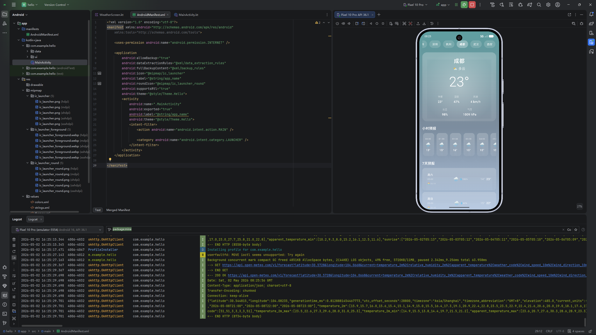

# hello天气 ☁️

<p align="center">
  
</p>

<p align="center">
  
  
  
  
</p>

---

> 🌤️ 一个美丽的 Android 天气应用 | 毛玻璃/液体玻璃 UI 设计

## 📱 截图预览

| 应用截图 |
|:--------:|
|  |

## ✨ 功能特点

| 功能 | 描述 |
|------|------|
| 🌡️ 实时天气 | 显示当前温度、体感温度、湿度、风速、气压 |
| 📅 7天预报 | 未来一周天气预报 |
| 🕐 小时预报 | 24小时逐时天气预报 |
| 🏙️ 城市切换 | 支持8个热门城市（北京/上海/广州/深圳/杭州/成都/武汉/西安） |
| 🎨 毛玻璃UI | 精美的液体玻璃/毛玻璃界面设计 |
| 🌈 动态背景 | 根据天气状况自动变换背景颜色 |

## 🛠️ 技术栈

- **Language**: Kotlin
- **UI Framework**: Jetpack Compose + Material Design 3
- **Architecture**: MVVM + Clean Architecture
- **Network**: Retrofit 2 + OkHttp 4
- **API**: [Open-Meteo](https://open-meteo.com/) (免费天气数据，无需API Key)

## 📂 项目结构

```
hello-weather/
├── app/
│   ├── src/main/
│   │   ├── java/com/example/hello/
│   │   │   ├── data/          # 数据层 (API, Repository, Models)
│   │   │   ├── ui/            # UI层 (Screens, Components, ViewModel)
│   │   │   └── theme/         # 主题配置
│   │   └── res/               # 资源文件
│   └── build.gradle.kts
├── gradle/                    # Gradle 配置
├── build.gradle.kts           # 项目级构建配置
└── README.md
```

## 🚀 快速开始

### 环境要求
- Android Studio Arctic Fox 或更高版本
- JDK 11+
- Gradle 9.4+

### 编译运行

```bash
# 克隆项目
git clone https://github.com/HenryMax2025/hello-weather.git

# 进入项目目录
cd hello-weather

# 编译 Debug 版本
./gradlew assembleDebug

# 安装到设备
adb install app/build/outputs/apk/debug/app-debug.apk
```

### APK 下载

[](https://github.com/HenryMax2025/hello-weather/releases/latest)

## 📊 数据来源

天气数据由 [Open-Meteo](https://open-meteo.com/) 提供，这是一个免费、开源的天气 API，无需 API 密钥。

## 📄 开源协议

本项目采用 [MIT](LICENSE) 开源协议。

---

<p align="center">
  Made with ❤️ by <a href="https://github.com/HenryMax2025">HenryMax</a>
</p>